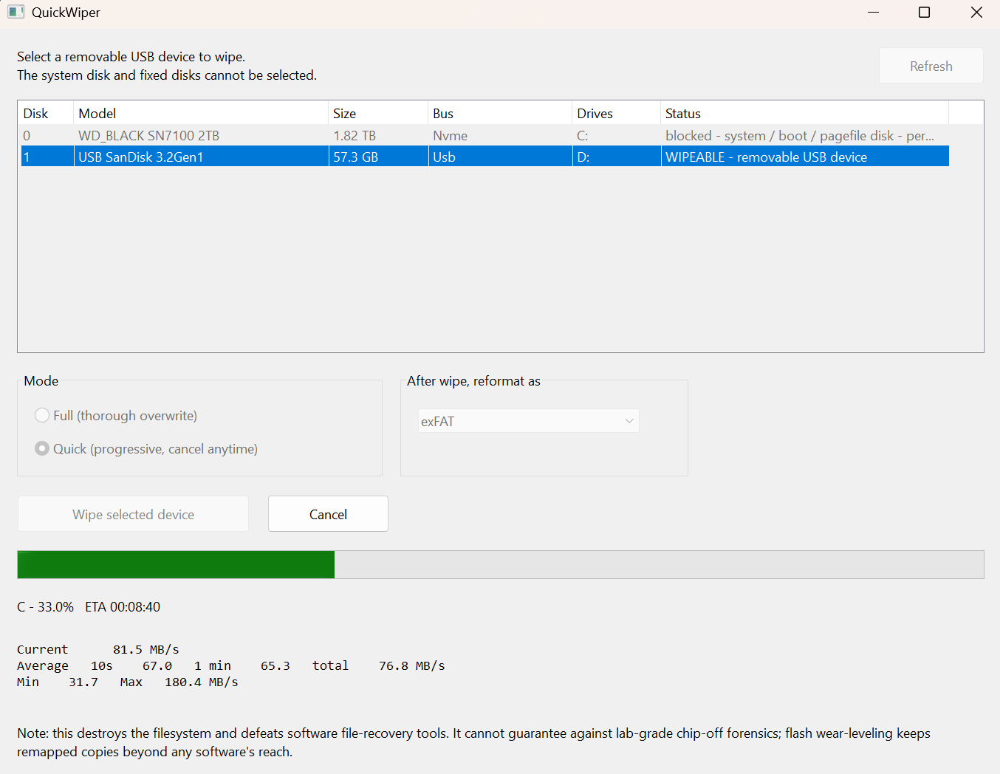

# QuickWiper

A tiny Windows tool that wipes an entire removable USB device and optionally reformats it to exFAT or NTFS. One native exe, no installer, runs elevated.



> Permanently destroys everything on the selected device — no undo. Only removable USB disks can be targeted; the system disk and fixed disks are always blocked.

## Build

```powershell
powershell -ExecutionPolicy Bypass -File native\build.ps1
```
